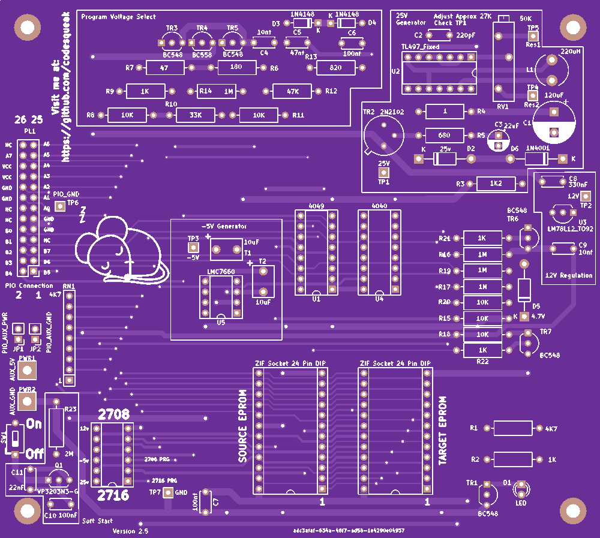

# Enhanced EPROM-Programmer Version 2.3

2708 / 2716 Enhanced EPROM Programmer

## Introduction

This card has been designed to be a functional replacement for the Bits & PCs Nascom EPROM Programmer.  It is fully compatible with the existing software.

The card is a completely new implementation of the design with a number of improvements over the original:

* Single power source requirement (+5V only)
* Completely new track layout
*	All components are readily available from commercial component suppliers (..and eBay!)
*	Single power switch,  EPROM selection via standard 12 PIN DIL socket mounted switch
*	LED power indicator
*	Power test points
* Adjustable 24/24V feed for 2708's

